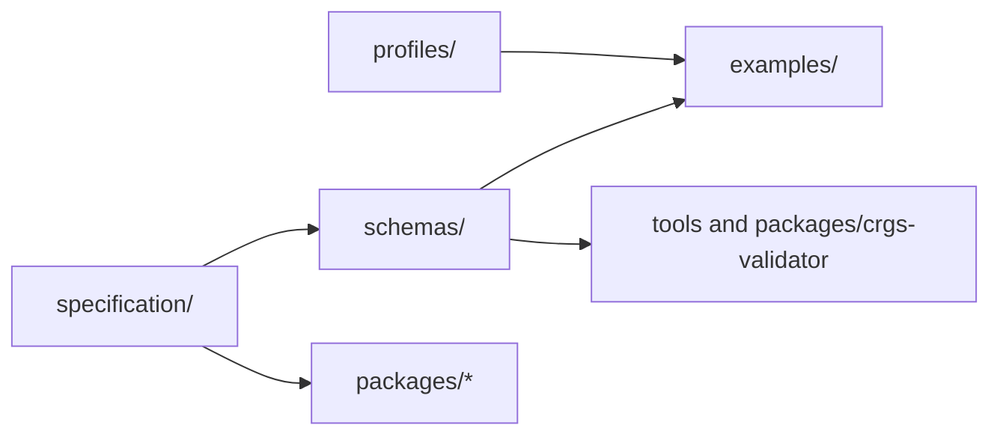
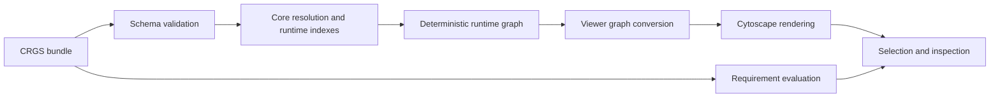

# Architecture

## Purpose

CRGS is organized as a layered standards repository rather than a single executable project. The architecture separates normative semantics, machine-readable schemas, illustrative data, and future implementation surfaces.

## Layers

1. Specification documents define meaning, constraints, and extension boundaries.
2. JSON Schemas define structural validation for serializations.
3. Profiles extend the core with system-specific vocabularies.
4. Example datasets exercise the specification and validation pipeline.
5. Packages provide reference implementations without locking the specification to one runtime or presentation layer.

## Repository Roles

- `docs/` contains architectural and governance material.
- `specification/` contains the normative chapters for CRGS itself.
- `schemas/` contains reusable JSON Schema Draft 2020-12 fragments.
- `profiles/` contains profile definitions that extend but do not rewrite the core.
- `examples/` contains reference bundles used by validation and tests.
- `packages/` contains typed reference tooling and the browser viewer.
- `tools/` contains repository-level scripts.

## Data Model Boundaries

The core model defines a graph-oriented representation with typed nodes and edges. Core semantics must remain system-neutral. System-specific abstractions such as a class system, sanity mechanic, or attack progression belong to profiles and data, not to the core.

## Reference Flow

## Viewer Flow

The reference viewer is a profile-independent consumer of the existing package APIs. It keeps canonical data immutable and creates a separate, ephemeral presentation model.

Core and profile schemas are bundled as static browser assets. The validator's in-memory API accepts these schemas without using filesystem APIs or fetching remote schemas. Cytoscape and ELK types, styling, layout coordinates, selection, filters, and highlighted paths remain confined to `crgs-viewer`.

Partially invalid bundles retain an inspectable viewer model when possible. Schema and resolver diagnostics keep their CRGS error codes and JSON paths; unresolved targets are represented as explicit diagnostic nodes rather than silently discarded.

## Package Intent

- `crgs-core` defines shared data structures and identifiers.
- `crgs-schema` packages published schema assets.
- `crgs-validator` hosts validation APIs.
- `crgs-cli` exposes repository and validation commands.
- `crgs-runtime` provides deterministic graph building and cycle detection.
- `crgs-viewer` provides the read-only React, Cytoscape, and ELK reference application.

## Stability Strategy

Version 0.2 establishes the current boundaries. Later work should refine semantics by extending schemas and documents incrementally rather than collapsing layers or embedding profile logic into the core.
